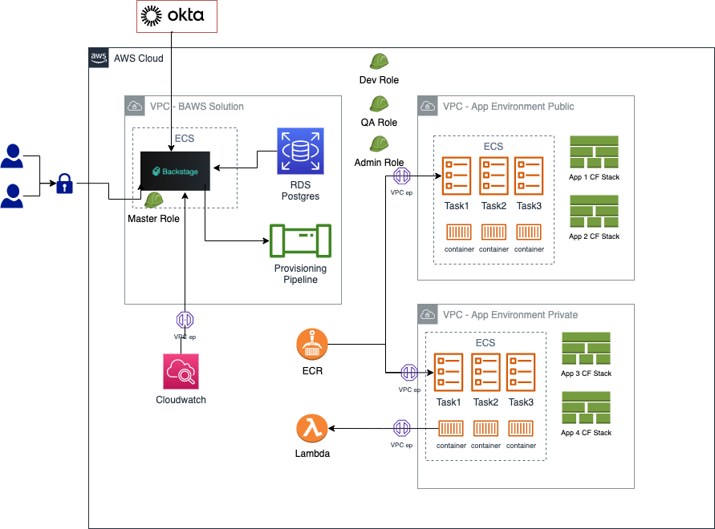

# OPA (Orchestrate Platform and Applications) on AWS

OPA Provides a new developer experience to simplify the use and consumption of AWS services while minimizing required expertise in cloud infrastructure technologies.  
Built on the [Backstage open platform](https://backstage.io), this solution makes the AWS cloud more accessible to application developers allowing them to focus on building application logic and delivering business value.

This solution leverages the flexibility and extensibility of the Backstage platform to provide customizable software templates, scaffolder actions, and deployment patterns. While this provides a lot of freedom in implementation, it can be overwhelming to get started.  To help users get started, a reference repository is also provided with samples to show how to use the solution.

:clapper: **Demonstrations and Tutorials**  
**COMING SOON!** Demonstration and tutorial videos.
<!-- For more information about the solution and its functionality, 
check out the demonstration and tutorial videos on our [YouTube playlist](https://www.youtube.com/playlist?list=PLhr1KZpdzukemoBUAPNUMCgGk88pdURJB). -->


## Getting Started
The solution is composed of two parts, the solution platform and Backstage plugins.  Combined, these provide the build, deployment, and security requirements to manage, provision, and operate your applications and runtime infrastructure in the AWS cloud:

1. Solution Platform - The solution platform provides the infrastructure to run a Backstage instance and supporting resources on AWS.  This provides the build, deployment, and security requirements to provision and operate your applications and runtime environments in the AWS cloud.
2. Backstage plugins - OPA plugins for Backstage contribute the user experiance and actions to Backstage to support the creation and management of applications and environments.

## Content

1. Architecture overview
2. Installation instructions
3. FAQs

## 1. Architecture Overview

See [ARCHITECTURE.md](./docs/ARCHITECTURE.md) for details about the solution architecture.  
<!--  -->

## Prerequisites

### Software prerequisites

The following software is required to perform the installation of the platform solution:
- [node.js](https://nodejs.org/en/) - 18.16 or higher
- [yarn](https://classic.yarnpkg.com/en/docs/install) - v1.x
- [aws-cli](https://docs.aws.amazon.com/cli/latest/userguide/getting-started-install.html)
- [aws-cdk](https://docs.aws.amazon.com/cdk/v2/guide/getting_started.html#getting_started_install)
- [jq](https://stedolan.github.io/jq/)
- [docker](https://www.docker.com/)
- [git](https://git-scm.com/book/en/v2/Getting-Started-Installing-Git)


> [!NOTE]  
> The installation instructions documented here were tested using the following versions:
> - Backstage v1.17
> - node v18.17
> - npm 9.6.7
> - cdk v2.95
> - yarn 1.22.19

### Solution Platform prerequisites

Prior to installing the OPA solution platform, you will need to ensure that the following items are configured and available:

* **AWS Account ID and region** - The solution will be installed into an AWS account and region.  You will need the 12-digit account ID and must be able to log into the account with sufficient permissions to provision infrastructure resources.

* **GitLab Community Edition EC2 AMI id** - The solution will install a small Gitlab instance where application source code will be stored.  The AWS Marketplace provides a **free**, community edition of Gitlab used by the solution.  
  * You will need to subscribe to the marketplace offering.  Search for "GitLab Community Edition" by GitLab or use a direct link: https://aws.amazon.com/marketplace/pp/prodview-w6ykryurkesjq
  * Once your account is subscribed to the Gitlab CE Marketplace offering, save the EC2 AMI for the appropriate region from the "Launch new instance" page as shown in the image below (_do not actually launch an instance as this will be done for you during installation_).  
    
   Alternatively, you can query for the AMI using the AWS CLI (substitute the apporpriate region value for the `--region` option):
      ```sh
      aws ec2 describe-images --owners "aws-marketplace" --filters "Name=name,Values=*GitLab CE 16.4.0*" --query 'Images[].[ImageId]' --region us-west-2 --output text
      ```

* **GitLab Runner image** - The solution will set up an EC2 instance as a GitLab Runner to execute GitLab CI/CD pipelines.  The Amazon-provided "Jammy" image will be used for the runner image.  Save the EC2 AMI for the appropriate region for this AMI.  The following AMI command will return the appropriate image id.  Replace the value for "--region" to reflect your target region:
   ```sh
   aws ec2 describe-images --owners "amazon" --filters "Name=name,Values=*ubuntu-jammy-22.04-amd64-server-20230208*" --query 'Images[].[ImageId]' --region us-west-2 --output text
   ```

* **Route 53 Hosted Zone** - The solution will ensure secure communcations and set up a certificate for your defined domain.  Ensure that a public hosted zone is set up in your account.  See the AWS documentation for [creating a public hosted zone](https://docs.aws.amazon.com/Route53/latest/DeveloperGuide/CreatingHostedZone.html)

* **Okta authentication** - The solution uses Okta and RoadieHQ Backstage plugins for authentication of users and groups.  You will need a client id, client secret, and API key for configuration of the solution.  If you wish to use Okta for authentication, you can [sign up a free *Workforce Identity Cloud* developer account](https://developer.okta.com/signup/).  
  * Once the account is set up, you will need to [configure an Okta API key](https://developer.okta.com/docs/guides/create-an-api-token/main/) for the [RoadieHQ backend catalog plugin](https://www.npmjs.com/package/@roadiehq/catalog-backend-module-okta)
  * A client id and secret are required to set up a Backstage Okta authentication provider.  See the [Backstage Okta auth documentation](https://backstage.io/docs/auth/okta/provider) for more details.  
  * Other IDPs are supported and could be substituted using different plugins.  Configuring alternative authentication is not covered in this README, but the [Backstage Authentication documentation](https://backstage.io/docs/auth/) provides details for other providers.

## 2. Installation

1. Clone the repository and change to the repository location
   ```sh
   git clone https://github.com/awslabs/app-development-for-backstage-io-on-aws.git
   cd app-development-for-backstage-io-on-aws
   ```

2. Configure the solution
   1. Copy the `config/sample.env` file to `config/.env`
   2. Edit the `config/.env` file and provide values for all of the environment variables.  The file is commented to explain the purpose of the variables and requires some of the information from the [Solution Platform Prerequisites](#solution-platform-prerequisites) section above.  
   :exclamation: The `SECRET_GITLAB_CONFIG_PROP_apiToken` variable **does not** need to be provided.  This will be automatically configured during installation after the platform is deployed.

3. Perform the installation
   1. Run `make install`  
   After the installation completes, the application will start up.  Open a browser and navigate to the 'OPA on AWS' endpoint using the Route 53 hosted zone name that you configured (e.g. `https://${R53_HOSTED_ZONE_NAME}`).  
   If any errors occur during installation, please review the `install_{datestamp}.log` file for details.  
   The Makefile target will automatically perform the following actions:
      * Install and configure Backstage
      * Install/update CDK
      * Deploy the solution platform AWS infrastructure
      * Update the configuration with GitLab information
      * Push a sample repository to GitLab
      * Build and deploy the Backstage image to AWS


## 3. FAQs

Q. I don't use Okta. Can i change the identity provider to another one?  
A. Yes.  Backstage [supports many IDPs](https://backstage.io/docs/auth/).  Once you configure Backstage for your chosen IdP, make sure Backstage catalog is synced with the users and groups from your IDP.

Q. I want to use another source control that is not GitLab. How can i do that?  
A. Backstage supports multiple source control providers which can be integrated through the Backstage config. OPA uses GitLab for several usage scenarios which you will need to migrate to another source control provider:

1. Storing application source code
2. Storing template source code
3. Storing pipelines jobs and orchestration
4. Update the Client API plugin that interacts with GitLab to the new source control provider


Q. I'm using Terraform, can I use this solution with Terraform to provision application resources?  
A. Yes. We provide a Node.js Terraform application for demonstration.  You may also write your own provider with Terraform.

## Security

See [CONTRIBUTING](CONTRIBUTING.md#security-issue-notifications) for more information.

## License

This project is licensed under the Apache-2.0 License.
