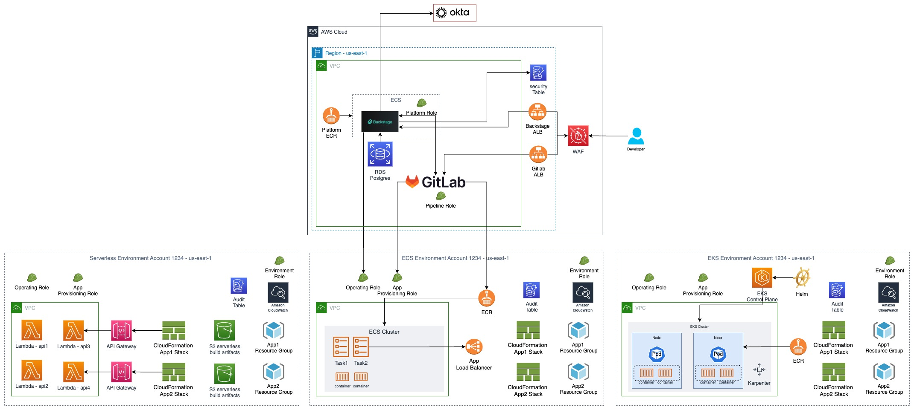

# Architecture - Harmonix on AWS

## Architecture Overview

OPA is intended to be used as a foundation and reference implementation for running Backstage itself on AWS and extending Backstage via UI plugins that make deploying resources and applications to AWS much simpler and with reduced cognitive load. These plugins make the job of an application developer and platform engineer much easier and help organizations to make use of reusable best practice implementations that can evolve over time. 

Platform engineers can use the OPA plugins to configure AWS accounts to run various types of workloads in the regions of their choice. They can also import application templates they've written into Backstage. OPA provides several different example application templates and runtime environment scripts that platform engineers can use to get started. These templates are not intended to limit what can be done with AWS/Backstage, but rather to provide a reference implementation that platform engineers can use to understand how they can create their own custom AWS runtime environment infrastructure and application templates.

Developers can create new applications from Backstage templates that have been set up for them by platform engineers. This will cause a new application repository to be created in Git, along with a CICD pipeline that will deploy the app to AWS. Once an app is created, Backstage will show many useful application details to developers in a single pane of glass, such as links to the application (if it is a website or API), a visual depiction of the resources (such as databases) that the application uses, the deployment status of the application, application logs, and much more.

The makers of OPA realize that each organization selects the toolset that they want to standardize on. We can't possibly implement every single variation of a toolset chain, so we instead selected popular tools and technologies and based our solution on them. For example, we have integrated with Okta as an identity provider and GitLab for Git hosting and CICD. OPA also provides reference implementations of Infrastructure as Code using CDK and Terraform.  Finally, OPA contains several different application templates that range in technology from Java/Spring to Python/Flask to NodeJS. These templates can run on containerized infrastructure, such as ECS/EKS, or serverless. 

Your organization likely uses some tools that we have not selected. However, OPA doesn't lock you in to our default choices. While the OPA team will continue to add features and options into the future, using a unique toolset may require some additional work on the part of your organization to customize the solution. The good news is that there are multiple ways to customize OPA/Backstage. The most common way is to use third party plugins that are already available for Backstage. For example, you could delete the OPA configurations that integrate with the Okta IDP and replace them with plugin configurations that integrate with Active Directory.

In some cases, simply switching plugins won't be enough and you will need to port or alter some OPA code. For example, to use a CICD pipeline other than GitLab, you could port over the OPA GitLab pipeline implementations to your Git provider of choice, or you could delete the OPA pipelines completely and start fresh.

One way to provide the OPA team with feedback on a tool or service you'd like to see supported would be to raise an issue in our GitHub repo and/or upvote requests by others who are requesting something you would also like to see supported.

### High-Level Architecture

In the below diagram, the top row/box depicts an AWS account that is hosting Backstage itself on ECS with Fargate. Backstage makes use of an Amazon Aurora PostgreSQL RDS database. There are also EC2 instances in this account that run GitLab. These EC2s are configured for reference implementation purposes and are not intended for production use, as is.

The second row of the below diagram depicts runtime environments that have been set up to run workloads on various AWS accounts and regions. Each workload account has an IAM role configured for operations and provisioning. The Backstage back end and the CICD pipelines running on the top row account will assume the IAM roles in the workload accounts in order to interact with them.

Depending on the workload type (ECS, EKS, Serverless), different resources will be created in the workload accounts. Each type has a VPC and an audit table, but only the containerized workload types will include a cluster.

### GitLab CICD Runner
This architecture illustrates how a GitLab CICD pipeline executes in order to build an application container image and publish it to an Elastic Container Registry repository.

### Specific use case architecture diagrams

**Developer creates new app**

1. Using Backstage UI, the developer chooses an application type they want to build

2. Once selected, the developer fills in all the required details of the template including ownership and AWS environment

3. The action triggered by the developer results in a new Git repository being created and an accompanying CICD pipeline. The pipeline will assume the IAM provisioning role for the the workload account and will execute Infrastructure as Code that is configured in the application template. After running the IaC, the pipeline will build the app and make it available for deployment by pushing an image into the ECR container registry or storing built artifacts in S3.

4. When the developer commits new changes to the Git repository, the CICD pipeline will automatically be triggered.

The below diagram depicts the creation and deployment of a serverless application.

**Multi Stage/Environment CICD**

