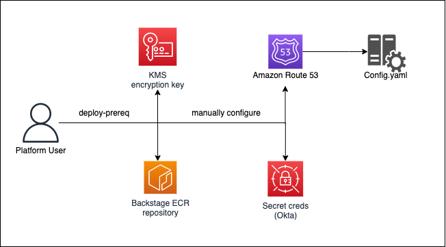
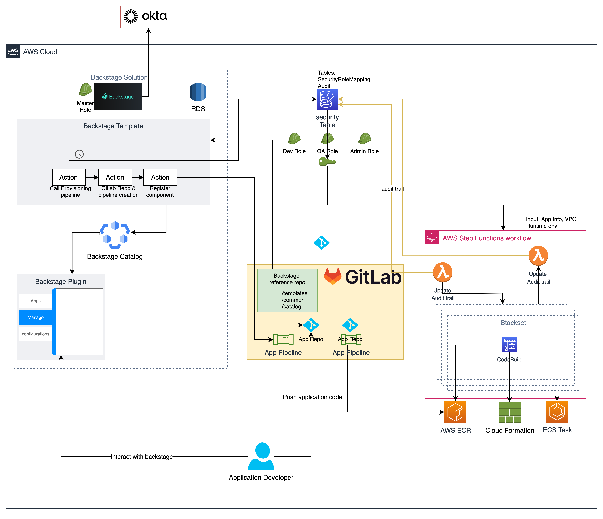
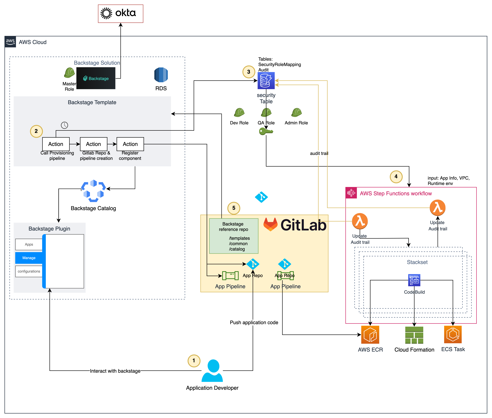
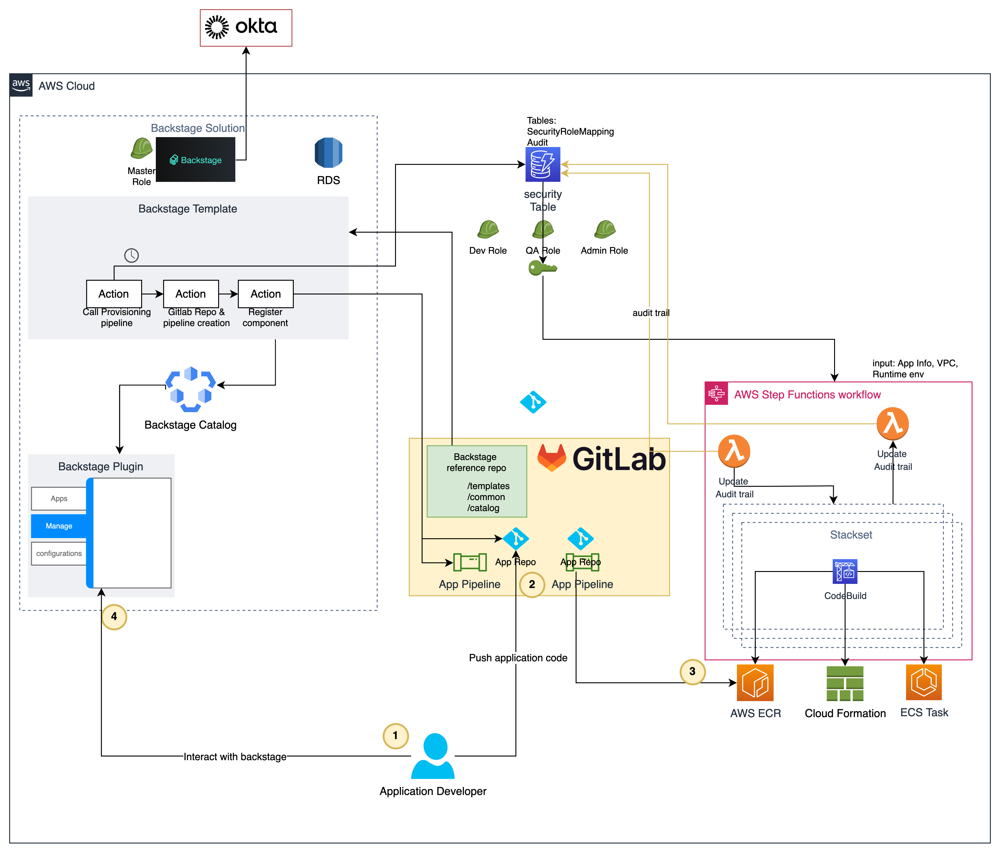
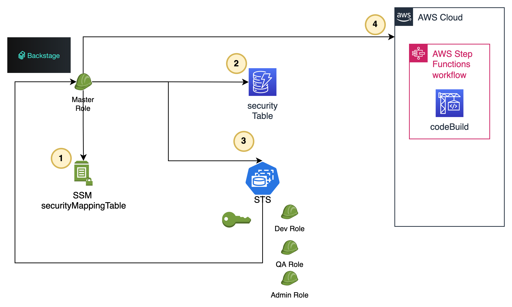
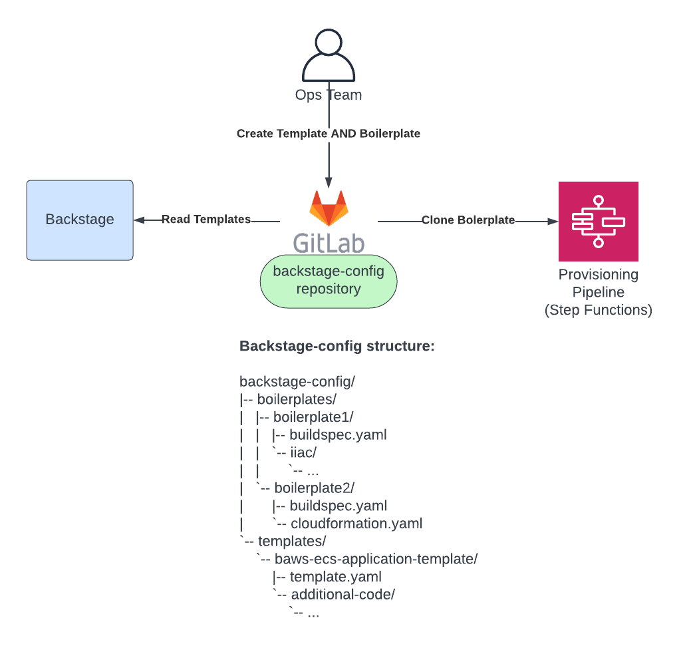

# Architecture - App Development for Backstage<!-- -->.io on AWS

## Architecture Overview
FIXME: Add high-level overview.  Declare how the solution is a sample that has chosen to use Okta as an IdP, Gitlab for source control, and ECS to run the Backstage application; however, alternatives can be used.  Installation and configuration for alternate plugins and deployment options are out of scope for this documentation.

### Prerequisite Infrastructure Deployment

An infrastructure prerequisite stack provides core resources required to support the solution.
The prerequisite stack will create:

1. **ECR repository** to hold Backstage container images.

2. **KMS** key used for all data at rest encryption of Backstage platform resources.

3. **Okta Secret** that will hold okta confiugration and credentails to be use as authentication provider for backstage.

4. **Gitlab Admin Secret** to store gitlab admin account credentials.

### Backstage Deployment

This architecture illustrates a high level overview of the AWS backstage.io app development solution. The diagram below shows 3 different AWS environments(one for backstage solution , and two to support applications created by backstage platform). each environment has its own network VPC, subnets and ECS Cluster. In the future it will also contain the Cloudformation stacks(application stacks) that will be deploy in the particular environment.

We are deploying Backstage into AWS Fargate to use with Amazon ECS to run containers without having to manage clusters of Amazon EC2 instances. The diagram shows that two Backstage services tasks will be running at all times. We are using **Amazon Aurora** as a database to store all of the entities that Backstage is managing.

*High level diagram of the AWS [backstage.io](http://backstage.io) app development solution*\

We are also using a Gitlab instance running on EC2 instances. Gitlab is used for several use cases:

1. To store the application code for the developers

2. To store reference repo for backstage - where we can easily manage entities, templates and catalog

3. To establish a pipeline to build and deploy code changes to ECR.

*Internal illustration of AWS backstage.io app development solution*

### GitLab CICD Runner
This architecture illustrates how a GitLab CICD pipeline executes in order to build an application container image and publish it to an Elastic Container Registry repository.

### Specific use case architecture diagrams

**Developer creates new app**

1. Using backstage UI the developer choose an application type they want to build

2. Once selected the developer fill all the reuired details of the template including ownership and AWS environment

3. The action trigger by the developer start the authentication process(see more details on auth use case below) which assumes the appropriate role for the user and return temporary credentials which in turn invoke the provisioning step function.

4. The provisioning step function is responsible in execute a series of Cloud formation stack, collect their outputs and respond them back to backstage.

5. The next step is to create a gitlab repository for the application and a dedicated application pipeline.

**Developer develops their application**

1. The developer commit change to the application gitlab repository

2. The commit execute a pre-configured pipeline which trigger the build & deploy process

3. The pipeline push the new container image to the application ECR

4. The developer restart the application using backstage UI to see the effect of his code changes.

**Auth Process**

1. Resolve security mapping table name

2. Resolve the IAM role from the auth provider mapping

3. Fetch temporary credentials for the designated role

4. Use Credentials to access appropriate AWS Services

**Admin workflow - Updating templates and app skeleton**

Admin workflow for updating templates and boilerplates:

"Templates" are a [backstage concept](https://backstage.io/docs/features/software-templates/software-templates-index) we are leveraging for resource and infrastructure deployment. Backstage can pull this from any url so we leverage the gitlab host for this. Additionally we use gitlab to enable step functions to pull from a central repository for infrastructure deployment.

### Backstage Pipeline

FIXME: Keep this section for public GitHub repo??  If so, there should be an introductory paragraph about what this is.

Step Functions Zoom in

