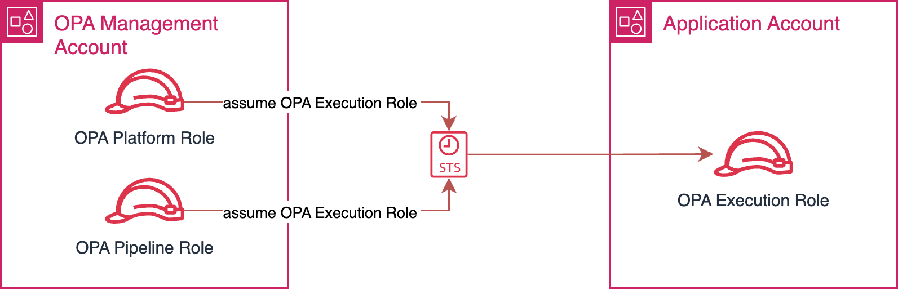

# AWS Control Tower and AFT

### Introduction
This article will describe how to inegrate Harmonix on AWS with AWS Control Tower and AFT-[Account Factory for Terraform](https://github.com/aws-ia/terraform-aws-control_tower_account_factory).


## Architecture
<p align="center">
  
</p>
* In the above architecture, we created a seprate OU to host IAC orchestration and an account for AFT to be deployed.
* We can also use the same OU to host Harmonix on AWS Platform and it's platform artifacts - this is **not** for workload controlled accounts 

## Installing AWS Control Tower and AFT

AWS Control Tower: **Must be deployed in your environment**.

Account Factory for Terraform (AFT): Must be deployed and configured with your Control Tower environment.

* For setting up Control Tower, follow this [link](https://docs.aws.amazon.com/controltower/latest/userguide/setting-up.html).
* For integrating AFT with your Control Tower environment, follow this [link](https://developer.hashicorp.com/terraform/tutorials/aws/aws-control-tower-aft).


## Integrating Harmonix on AWS to AFT
### Introduction
The AFT pipeline provide a process that create accounts by submitting a request to "account-requests" repository, as shown in the below diagram:

<p align="center">
  
</p>

The integration with Harmonix on AWS Platform is based on the principle of customization template - that creates a pre-baked role, that the platform / Harmonix pipeline can use to provision resources.

### Step 1: Create Harmonix Management Account

This step is option. You can choose to deploy Harmonix in any existing account; however, we as a best practice we discourage doing so.

1. Create an AWS account within your Control Tower environment named `Harmonix Management`. This account will host the Harmonix infrastructure.
2. AFT Repositories: AFT supports four repositories for account management and customizations:

  * account_request_repo_name: Manages new account requests.
  * global_customizations_repo_name: Applies customizations across all AFT-created accounts.
  * account_customizations_repo_name: Customizes specific accounts.
  * account_provisioning_customizations_repo_name: Sets up custom non-Terraform integrations pre-account provisioning.

1. Account Request:

  * Add an account request for the `Harmonix Management` account in the account_request repository.

```tree
├── account-request
│   └── terraform
│       ├── aft-providers.jinja
│       ├── backend.jinja
│       ├── modules
│       │   └── aft-account-request
│       │       ├── ddb.tf
│       │       ├── variables.tf
│       │       └── versions.tf
│       └── harmonix_account-request.tf
```


harmonix_account-request.tf ->
```terraform
module "harmonix_account_admin" {
  source = "./modules/aft-account-request"
  
  control_tower_parameters = {
    AccountEmail              = "<email>"
    AccountName               = "Harmonix Management"
    ManagedOrganizationalUnit = "<ou>"
    SSOUserEmail              = "<user-email>"
    SSOUserFirstName          = "<first-name>"
    SSOUserLastName           = "<last-name>"
  }
  
  account_tags = {
    "Owner"       = "<owner>"
    "Division"    = "<division>"
    "Environment" = "<env>"
    "CostCenter"  = "<cost-center>"
    "BUCode"      = "<bu-code>"
    "Project"     = "Harmonix"
  }
  
  change_management_parameters = {
    change_requested_by = "Organization AWS Control Tower Admin"
    change_reason       = "Deploy Harmonix Management Account to host Harmonix infrastructure"
  }
  
  custom_fields = {
    note = "This account will be used to deploy Harmonix management portal infrastructure"
  }
}
```

* Push these changes to trigger account creation with AFT. Wait for completion before proceeding to Step 2.

### Step 2: Deploy Harmonix

1. Access: Ensure you have access to the Harmonix management account with the necessary permissions to deploy required infrastructure.
2. Installation: Follow Harmonix installation steps via this [link](../getting-started/deploy-the-platform.md).


### Step 3: Set up IAM Role for Application Account

1. Automation with AFT: Use AFT for automating IAM role creation (**HarmonixExecutionRole**) in the Application account, allowing Harmonix Management account to manage resources.
2. Customization Code:

  * Specify this as a template (**Harmonix_INTEGRATION**) in the Account Customization AFT repository.

```tree
├── account-customizations
│   └── Harmonix_INTEGRATION
│       ├── api_helpers
│       │   ├── post-api-helpers.sh
│       │   ├── pre-api-helpers.sh
│       │   └── python
│       │       └── requirements.txt
│       └── terraform
│           ├── aft-providers.jinja
│           ├── backend.jinja
│           └── main.tf
```

main.tf ->
```terraform
data "aws_ssm_parameter" "harmonix_org_id" {
  name = "/aft/account-request/custom-fields/harmonix-org-id"
}

data "aws_ssm_parameter" "aft_management_account_id" {
  name = "/aft/account-request/custom-fields/harmonix-account-id"
}

data "aws_ssm_parameter" "harmonix_pipeline_role" {
  name = "/aft/account-request/custom-fields/harmonix-pipeline-role"
}

data "aws_ssm_parameter" "harmonix_platform_role" {
  name = "/aft/account-request/custom-fields/harmonix-platform-role"
}

data "aws_iam_policy_document" "assume_role_policy" {
  statement {
    effect  = "Allow"

    principals {
      type        = "AWS"
      identifiers = [
        data.aws_ssm_parameter.harmonix_platform_role.value,
        data.aws_ssm_parameter.harmonix_pipeline_role.value
      ]
    }

    actions = ["sts:AssumeRole"]

  }
}

resource "aws_iam_role" "admin_role" {
  name               = "HarmonixExecutionRole"
  assume_role_policy = data.aws_iam_policy_document.assume_role_policy.json
}

resource "aws_iam_role_policy_attachment" "admin_attach" {
  role       = aws_iam_role.admin_role.name
  policy_arn = "arn:aws:iam::aws:policy/AdministratorAccess"
}
```

* Push Customization Code: Update the specified account customization repository with this code.



### Step 4: Create Application Account for Harmonix Integration

1. Account Request:

  * Create an Application account creation request tailored for Harmonix on AWS.
```tree
├── account-request
│   └── terraform
│       ├── aft-providers.jinja
│       ├── backend.jinja
│       ├── modules
│       │   └── aft-account-request
│       │       ├── ddb.tf
│       │       ├── variables.tf
│       │       └── versions.tf
│       ├── harmonix_moderated_account1.tf
│       └── harmonix_account-request.tf
```

harmonix_moderated_account1.tf->
```terraform
module "harmonix_app_account_1" {
  source = "./modules/aft-account-request"

  control_tower_parameters = {
    AccountEmail              = ""
    AccountName               = "Harmonix Application Account 1"
    ManagedOrganizationalUnit = "Sandbox"
    SSOUserEmail              = ""
    SSOUserFirstName          = ""
    SSOUserLastName           = ""
  }

  account_tags = {
    "Owner"       = ""
    "Division"    = ""
    "Environment" = ""
    "CostCenter"  = ""
    "BUCode"      = ""
    "Project"     = "Harmonix"
  }

  change_management_parameters = {
    change_requested_by = "Organization AWS Control Tower Admin"
    change_reason       = "Deploy Harmonix Application Account 1"
  }

  custom_fields = {
    note = "This account will be used to deploy applications from Harmonix management portal"
    harmonix-org-id = "Harmonix_ORG_ID"
    harmonix-account-id = "Harmonix_ACCOUNT_ID"
    harmonix-pipeline-role = "Harmonix_PIPELINE_IAM_ROLE"
    harmonix-platform-role = "arn:aws:iam::Harmonix_ACCOUNT_ID:role/backstage-master-role"
  }

  account_customizations_name = "Harmonix_INTEGRATION"
}
```

**Note**: We are using custom_fields here to inject variables that will be used by the Account Customization Harmonix_INTEGRATION template

The actual values for these variable needs to be fetched from the Harmonix management account and Control Tower management account


* Login to the Harmonix Management account under the IAM service and Role. Copy the harmonix-pipeline-role and harmonix-platform-role
* Login to the Control Tower management account. From the Control Tower service -> Organization tab, copy the Harmonix management account ID and the Organization ID that the Harmonix management account is part of.

1. Completion:

  * Push the request to the Account Request repo and wait for account creation to complete.


Congratulations! You have successfully set up an Application account ready for Harmonix integration. For deploying applications using Harmonix, follow this [link](../getting-started/videos.md).
