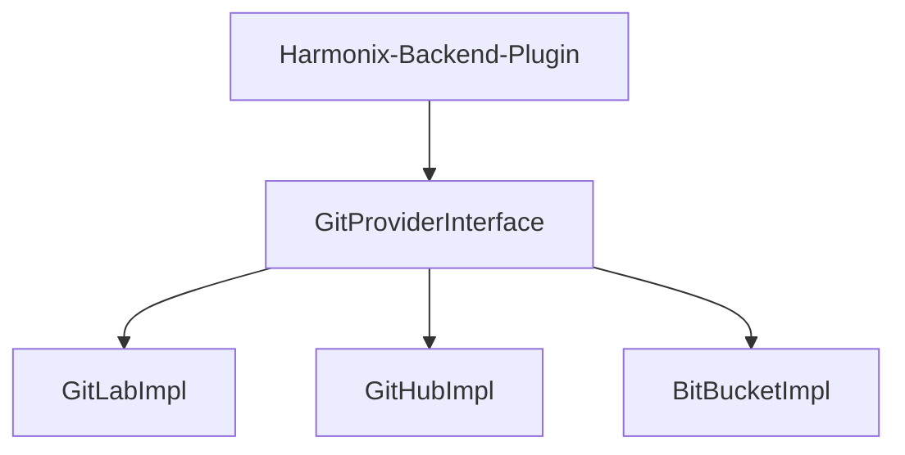

# Git

### Introduction
This article will describe how Harmonix on AWS integrates with various git providers including Gitlab and Github. In addition, we provide a deeper dive and customization examples to add your own git provider.


## Architecture



## Git provider interface

Currently, Harmonix on AWS offers two git implementations:
1. GitLabs
2. GitGub

However, you can implement additional git providers and customize the backend plugin: @aws/plugin-aws-apps-backend-for-backstage .
The Git provider interface *ISCMBackendAPI* exposes five methods that are required to be implemented to enable a new git provider.

SCMBackendAPI.ts ->
```typescript
export interface ISCMBackendAPI {
    deleteRepository: (repo: IRepositoryInfo , accessToken: string) => Promise<IGitAPIResult>;
    createRepository: (repo: IRepositoryInfo, accessToken: string) =>  Promise<IGitAPIResult>;
    getFileContent: (filePath: string, repo: IRepositoryInfo, accessToken: string) =>  Promise<IGitAPIResult>;
    commitContent: (change:ICommitChange, repo: IRepositoryInfo, accessToken: string) =>  Promise<IGitAPIResult>;
}
```

A new git provider will need to implement the above methods. You can review the existing implementation examples here:
```tree
├── aws-apps-backend
│   └── src
      ├── api
      │   ├── AwsAppsApi.ts
      │   ├── **github-api.ts**
      │   ├── **gitlab-api.ts**
      │   └── index.ts
      ├── index.ts
```

## Attaching a new git provider

### Adding a new git provider type
In the common plugin @aws/plugin-aws-apps-common-for-backstage , edit the file /src/types/*git-providers.ts*
example: adding BitBucket:

```typescript
export enum GitProviders {
    GITLAB = "gitlab",
    GITHUB = "github",
    UNSET = "unset"
    BITBUCKET = "bitbucket"
  }
```

### Registering a new git provider
In the backend plugin @aws/plugin-aws-apps-backend-for-backstage, edit the file /src/api/*git-api.ts*
Add your new git provider and register your implementation.
example: Adding BitBucket

```typescript
import { GitProviders, ISCMBackendAPI } from '@aws/plugin-aws-apps-common-for-backstage';
import { GitLabAPI } from './gitlab-api';
import { GitHubAPI } from './github-api';
// Add your impl here
import { GitBitBucketAPI } from './gitbit-bucket-api';
import { LoggerService } from '@backstage/backend-plugin-api';


public constructor(
        readonly logger: LoggerService,
        readonly gitProvider: GitProviders
      ) {
        this.logger = logger;
        this.gitProvider = gitProvider;
        this.logger.info(`Instantiating GitAPI with ${gitProvider}...`);
        if (gitProvider === GitProviders.GITLAB) {
          this.git = new GitLabAPI(logger);
        }else if (gitProvider === GitProviders.GITHUB) {
          this.git =  new GitHubAPI(logger);
         } 
         else if (gitProvider === GitProviders.BITBUCKET) {
          this.git =  new GitBitBucketAPI(logger);
         } 
         else if (gitProvider === GitProviders.UNSET) {
          this.git =  new GitHubAPI(logger);
         } 
         else
         {
            throw new Error("Invalid / unsupported Git Provider");
         }
      }

```

:::info
Adding a git provider will allow Harmonix on AWS to preform the same actions based on your implementation, However you will still need to to implement the corresponding pipelines to complete the event execution. Please see the [GitLabs pipelines examples](https://github.com/awslabs/harmonix/tree/main/backstage-reference/common/cicd) we provide as a reference for your desired pipeline tool.
:::

:::tip
Don't forget to add your new git provider to backstage *app_config.yaml* under /catalog/provider/bitbucket. [backstage documentation](https://backstage.io/docs/integrations/bitbucketCloud/discovery#configuration)

:::