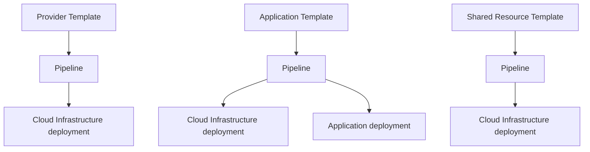
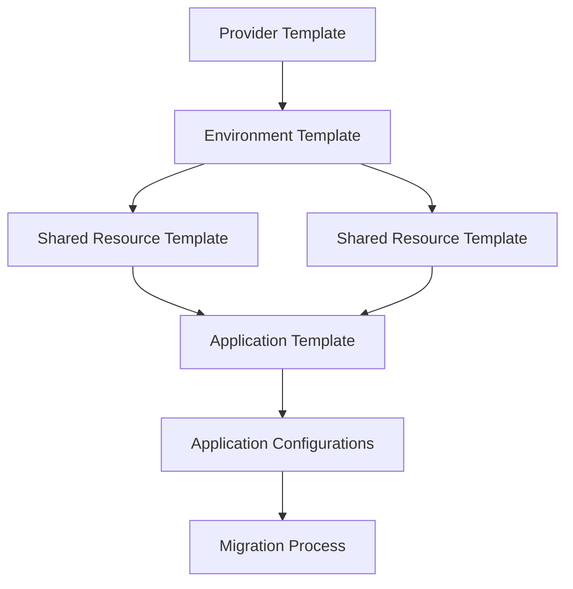
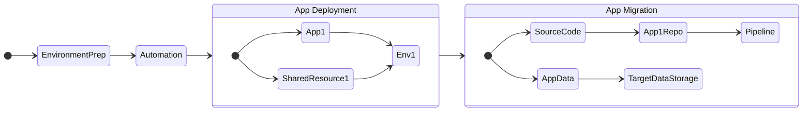

# Overview

Migrating applications to the cloud can be a challenging task. There multiple aspects to consider and not all applications are the same.
The focus of this documentation is to help customers design and build automation to move workloads to the cloud with as few changes as possible.

## Understanding Application Components
To successfully migrate an application we first have to understand all the application components, dependencies, and composition. 

Here are some examples of common application components:
1. **Application source code**.
1. **Application-related resources**, such as: databases, caches, queues, streams etc. 
1. **Shared resources**, such as databases that are referenced by multiple applications
1. **Application configuration**: port, database url, keys, environment variables etc.
1. **Infrastructure configuration** to support the application: required CPU, RAM, runtime environment, networking, exposure, resiliency configurations etc.
1. **CICD**: pipelines and automation for continuous integration and continuous deployment
1. **Application data**
1. **Firewall configuration**
1. **Composition** and relations to other applications and resources
1. **Security related components** - encryption, required security scans
1. **Observability and logging**

## Setting up Target Components

Before we can look at mapping the application source components to a migration plan, we need to prepare the target environment's application specifications.

Prior to the steps below, a landing zone and organizational foundation needs to be created. Many customers use [AWS Control Tower](https://aws.amazon.com/controltower/) to provide an easy landing zone with guardrails and controls built in. It may also be considered to introduce centralized networking components, observability and monitoring across the organization and integration with on-premises resources. This article does not address this process.

### Step 1 - Target Cloud Infrastructure
Based on the type of application, we need to prepare target environments on AWS. Items to decide upon include:

1. The account(s) that will be used
2. The region(s) for the application
3. How many environments are needed? Dev, Test, Staging, Prod
4. Underlying network topology - VPC
5. The type of application - Containerized, Serverless, Legacy EC2, Other
6. The technology to implement the infrastructure runtime: EKS, ECS, Serverless, Classic EC2 etc.

In addition, we will need to estimate the number of applications that may share the same environment - this will influence the capacity requirement and the default configurations per app. If we use serverless solutions, this step may be easier as capacity is on-demand.

All of these requirements will be encapsulated in Infrastructure as Code (IaC) that can be provisioned based on the desired arguments (see above).

The result of this step is one or more templates of AWS Environment and AWS Environment Providers that will support our future migrated applications.

### Step 2 - Target Application Template

We will need to define the application resources (IaC) that compose our application, including the task / process that will run it all the way to the required application runtime (e.g. Java, Python, Node, .Net).

In addition, we will need to know the estimated configuration for the application in terms of: CPU, Memory and storage.
Lastly, we will need to set the application configuration such as: environment variables, application logic configuration and metadata.

The result of this step is a template for this type of application pattern that relies on the infrastructure of *step 1* but also captures all the required resources for the application:
1. Application identity / role
2. Task definition / container specification
3. Secret and configurations
4. Output log configuration
5. Supporting infrastructure - buckets, log groups, tags

### Step 3 - Additional Shared Resources
Now we need to find out if the application requires other resources such as: databases, S3 buckets, shared file systems, queues, streams etc.

If it does, we will need to create a shared resource template for each one, including IaC and support for future policy permissions grants. [See this example](https://github.com/awslabs/harmonix/tree/main/backstage-reference/common/aws_rds).

### Step 4 - Pipelines
In order to orchestrate the templates above, we will need to build appropriate pipelines for each one of them.

The expression of the pipeline is based on your CI/CD tooling and should be generalized to the the technology that is deployed or application use case. The implementation should include

1. IAC deployment pipeline
1. Application deployment pipeline

## Orchestrating Migration Automation

Let's look at the components we have built so far.  Every template has IaC that gets provisioned through the pipeline and deploys the resource on our target account:

:::info
Orchestrating the creation of these components needs to be carefully considered as order matters and we can only apply certain configurations after a dependent template is properly provisioned.
:::

### Automating and Creating target components

Because we can only provision an application to an existing environment - we must first create the environment and only then deploy the application.
However, while creating the application we may need to attach shared resources; therefore, we may want to create shared resources before the application is created.
Lastly, once the application is created, we can apply the configuration required before starting the migration process.

### Migration Process
If we put all these steps together to create an ordered migration plan, we will assemble a two-phase migration process.
1. App deployment: prepare all target resources (environment, provider, application and shared resources)
2. App migration: migrate the source code and data of the application

### Migration Validation
Lastly, we would want to validate the migrated applications.  There are several approaches to automate the validation process.

1. Running unit tests against the new target application endpoint
2. Data validation and data integrity testing
3. Integration testing - Application access and cross application communication 
4. Scaling and performance testing
5. Resiliency testing

:::tip
Leveraging the platform is a good practice as it not only provides information about the deployed application, but it also provides information about the relationship, the environment, and a single place to query all of this data through standardized APIs.
:::
