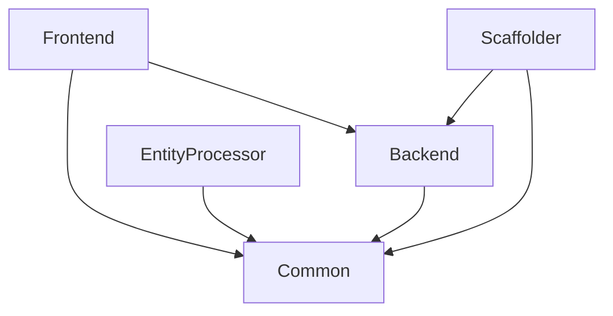

# Plugins

Harmonix on AWS published four plugins, which together compose the platform and provide the integration with AWS services.

## Architecture

Backstage Plugins description

| Plugin | Type  | Description |
| :------------------- | ---- | :----------------------------------------------------------------------------------------- |
| Backend - @aws/plugin-aws-apps-backend-for-backstage| Backstage backend plugin | responsible for all outgoing API calls to AWS, SCM (Gitlab) and the platform |
| Frontend - @aws/plugin-aws-apps-for-backstage| Backstage frontend plugin | responsible for all UI interaction components - pages, components, state and frontend API |
| Common - @aws/plugin-aws-apps-common-for-backstage| Backstage isomorphic plugin | shareable plugin for both frontend, backend and scaffolder, used to define interfaces and types |
| Scaffolder - @aws/plugin-scaffolder-backend-aws-apps-for-backstage| Backstage scaffolder plugin | contains the actions required to execute the templates |
| Catalog entities processor-  @aws/backstage-plugin-catalog-backend-module-aws-apps-entities-processor | Backstage catalog entity processor plugin | a plugin to support the processing for the custom kind AWS Environment & AWS Environment provider |

:::tip
For more information on backstage plugins visit [Backstage plugin documentation](https://backstage.io/docs/plugins/backend-plugin/#creating-a-backend-plugin)  
:::

## Plugin dependencies  

## Plugin source code

1. [Backend plugin](https://github.com/awslabs/app-development-for-backstage-io-on-aws/blob/main/backstage-plugins/plugins/aws-apps-backend/README.md)
2. [Frontend plugin](https://github.com/awslabs/app-development-for-backstage-io-on-aws/blob/main/backstage-plugins/plugins/aws-apps/README.md)
3. [Common plugin](https://github.com/awslabs/app-development-for-backstage-io-on-aws/blob/main/backstage-plugins/plugins/aws-apps-common/README.md)
4. [Scaffolder plugin](https://github.com/awslabs/app-development-for-backstage-io-on-aws/blob/main/backstage-plugins/plugins/scaffolder-backend-module-aws-apps/README.md)
5. [Entity Processor plugin](https://github.com/awslabs/app-development-for-backstage-io-on-aws/blob/main/backstage-plugins/plugins/catalog-backend-module-aws-apps-entities-processor/README.md)
