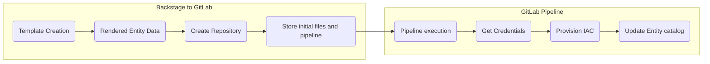
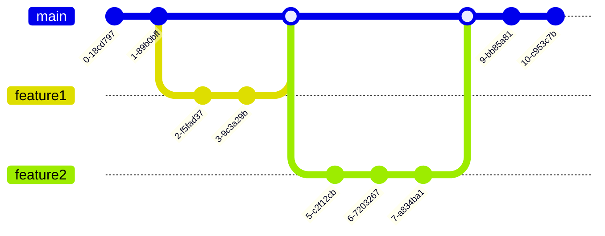

# Processes

## Deploying a template
:::info
The process describe below is true for all template with the exception of AWS Environment.
:::

When a user select a template in the catalog and submit *Create*, The below process is initiated.


1. **Template Creation**: The process of filling the template with the required input from the user, text fields, selecting other entities, choosing options etc. 
2. **Rendered Entity Data**: Based on the previous selection this process will fetch all the required data before populating the repository, this includes information about the selected environment entity, platform configurations and entity rendered data. you can see the result of this process in the generated repository right after creation. This process make use of the Scaffolder actions plugin
3. **Create Repository**: Create the git repository for the entity, code, iac and environment information. based on the type of template the repository will be created in a git project group: environments, environment-providers, aws-app, aws-resources. this allows to segregate access control from managing repositories under different security domains.
4. **Store initial files and pipeline**: Persisting the generated files from step 2 in the repository including the particular pipeline pattern that fit the selected template (See below for more details on pipeline process).
5. **Pipeline execution**: Using gitlab runner executing the pipeline in a separate shell: docker / kanko
6. **Get Credentials**: Fetch credentials from the target(Environment provider) provisioning role in order to provision the IAC for the template.
7. **Provision IAC**: Provision the IAC against the target destination (Environment provider) - cdk deploy / terraform apply
8. **Update Entity catalog**: Based on step 7 select the desired IAC deployment output and update the entity catalog file (*catalog-info.yaml*) with the resources information.

## Executing Gitlab pipeline
The pipeline execution process composed of several patterns and abstractions. This was done for several reasons, but mostly for reusability and security controls.

### Abstracted centralized pipelines
In order to allow updates and changes for pipelines that may be enforced by the platform engineering team we need to externalized some of the pipeline actions and provide only the necessary variables as an input.
```pipeline title=".gitlab-ci.yml"
stages:
  - env-creation
  - prepare-dev-stage
  - dev-stage

variables:
  APP_SHORT_NAME: "my-app"
  APP_TEMPLATE_NAME: "example-nodejs"
  OPA_PLATFORM_REGION: "us-east-1"

include:
  - project: 'opa-admin/backstage-reference'
    ref: main 
    file:
      - 'common/cicd/.gitlab-ci-job-defaults-cdk.yml'
      - 'common/cicd/.gitlab-ci-aws-base.yml'
      - 'common/cicd/.gitlab-ci-aws-iac-ecs.yml'
      - 'common/cicd/.gitlab-ci-aws-image-kaniko.yml'
```
The first part of our pipeline *stages* define the stages of this pipeline for the current state. This part is not fixed, we may introduce more stages when our will be deployed to additional environments. Nonetheless we can see the first two stages for our dev environment:
1. *prepare-dev-stage* - this stage provision and prepare the environment to be able to run the application before we start making continues code changes to our repositories.
2. *dev-stage* - this stage is responsible to compile, build and deploy new version of our application each time we push new code changes to our application logic (/src directory)

The *env-creation* is the stage to create the two stages above, the reason this is a stage on it's own is because we can reuse it to create more stages overtime when the application deploys to other environments. 

:::tip
The *include* clause allows us to dynamically pull pipelines from another repository each time the pipeline will run.
:::

### Modular pipelines
The idea of modular pipelines is to include smaller pipelines that contains jobs. which together can provide a  building block for different pipelines orchestration. You may already noticed from the example above we use several include statements. These statements helps to reuse similar functionally for different templates / application patterns. 

The complete list of pipelines patterns is available at: [CICD Directory](https://github.com/awslabs/app-development-for-backstage-io-on-aws/tree/main/backstage-reference/common/cicd)

1. .gitlab-ci-aws-base.yml
2. .gitlab-ci-aws-dind-spring-boot.yml
3. .gitlab-ci-aws-iac-ecs.yml
4. .gitlab-ci-aws-iac-rds.yml
5. .gitlab-ci-aws-iac-serverless-api.yml
6. .gitlab-ci-aws-iac-tf-ecs.yml
7. .gitlab-ci-aws-image-kaniko.yml
8. .gitlab-ci-aws-provider-ecs.yml
9. .gitlab-ci-aws-provider-serverless.yml
10. .gitlab-ci-aws-tf-base.yml
11. .gitlab-ci-job-defaults-cdk.yml
12. .gitlab-ci-job-defaults-tf.yml

### Pipeline jobs

There are several job imported to the pipeline based on the pattern you use. The below is an example of pipelines execution and the job for each one of them:
<p align="center">

</p>

1. **Initial commit**
   1. create-ci-stages - The job create new stages for a target environment with its providers.
2. **Added CICD environment stage**
   1. iac-deployment-ENVXXX-ProviderYYY - the job provision IAC against the target environment/provider
   2. get-aws-creds-ENVXXX-ProviderYYY - the job gets credentials from the provisioning role of the target provider 
   3. build-image-ENVXXX-ProviderYYY - the job build a new image from the /src directory and update the container image
   4. delete-aws-creds-ENVXXX-ProviderYYY - delete the temporary credentials so that they are not persisted in the repository
3. **updating entity details** - update cataloginfo.yaml with the IAC metadata. no need to run the pipeline again after this update.

## Deploy an application to another environment
The process of deploying an application to another environment works by utilizing the jobs and stage we describe above. To visualize how does git pipeline looks like on multi deployment let's look at the below diagram.

<p align="center">

</p>

We can see that once we deploy an application to another environment we essentially created new stages for the new target environment.
:::tip
The process to deploy an application to another environment is done by submitting a commit to git with a specific message **generate CICD stages** along with a properties file that contains the information of the new target environment. when the pipeline job will run it will process the new file and create a corresponding stages for the new target destination. This change will automatically execute the pipeline and stage to deploy the application to the new target environment.
:::

### Continues deployment for app code
How does the application logic code changes propagate to multiple environments?
For example - if we have the below pattern of commit on our repository - every time we merge changes to the main branch /src directory (Can be configure differently) the ENV-XXX-stage will be trigger. 
<br/>
If we have several stages for multiple environments all of them will be triggered with the original order they have been created.



:::note
If we configured the environment with *"Requires approval"* the pipeline that pushes code changes will halt until an approval is granted. this is useful in cases that we would want supervision of what changes are propagated to a sensitive environment. Additional security control measurement can also be implemented.
:::

