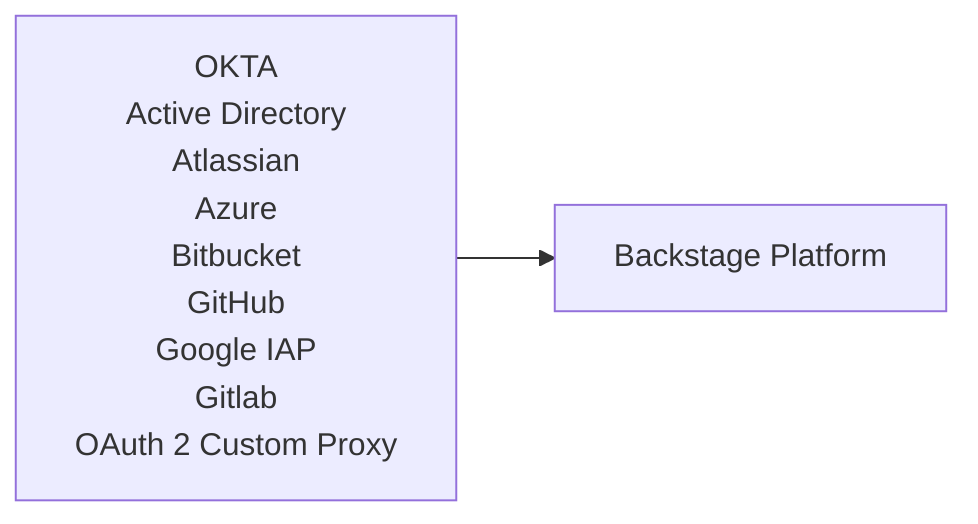
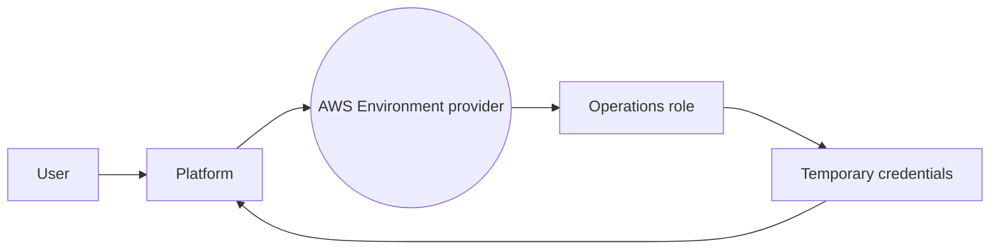
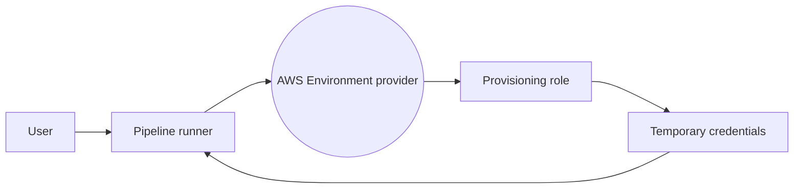
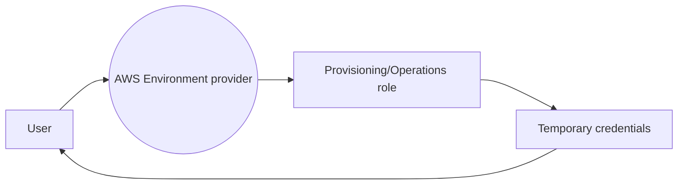
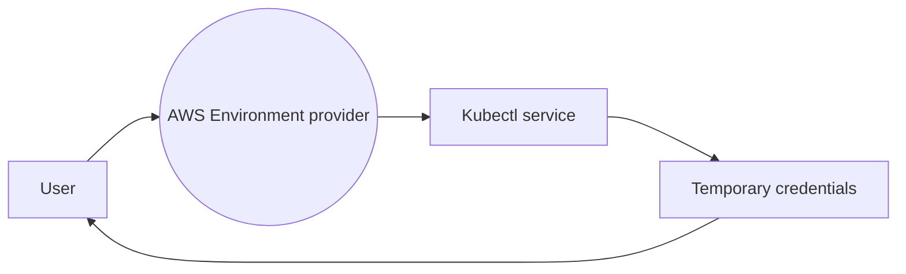

# Security

## Authentication with Backstage
OPA on AWS comes pre-configured to use OKTA as an Identity provider. While this demonstrates one type of identity provider, it can easily be changed to other common identity providers such as Active Directory or any other OAuth 2 supported provider.

:::info
There are multiple Identity Providers that are supported by Backstage. For the complete list, consult the [Backstage reference](https://backstage.io/docs/auth/)
:::

### Identity providers with Backstage



The configurations to use an external IDP with Backstage require mapping to Backstage schemas - in particular the "Users" and "Groups" Schemas.
Backstage offers two kinds: 
```
"kind": "Group"
"kind": "User"
```
The prescribed relationship between them can be expressed as (Okta example):
```
  {
        "metadata": {
            "namespace": "default",
            "annotations": {
                "backstage.io/managed-by-location": "okta-org:all",
                "backstage.io/managed-by-origin-location": "okta-org:all"
            },
            "name": "some user name",
            "title": "********@amazon.com",
            "uid": "44e7bc31-4343-4145-ba7a-37796d7df965",
            "etag": "15bd46919fe1befaea71cec3293584b82231e3db"
        },
        "kind": "User",
        "apiVersion": "backstage.io/v1alpha1",
        "spec": {
            "profile": {
                "email": ""********@@amazon.com"
            },
            "memberOf": []
        },
        "relations": [
            {
                "type": "memberOf",
                "targetRef": "group:default/admins",
                "target": {
                    "kind": "group",
                    "namespace": "default",
                    "name": "admins"
                }
            },
            {
                "type": "memberOf",
                "targetRef": "group:default/developers",
                "target": {
                    "kind": "group",
                    "namespace": "default",
                    "name": "developers"
                }
            },
        ]
    },
```

OPA on AWS uses the Backstage schema (entity provider) to allow access, both on the Backstage platform and on AWS. Therefore, if you change the source which populates the Backstage identity schema, the behavior remains the same.

To configure LDAP with Backstage, consult the Backstage reference on [LDAP Organizational Data](https://backstage.io/docs/integrations/ldap/org/)

### Populating Backstage identity schema
OPA on AWS uses the [**roadiehq catalog-backend-module-okta**](https://www.npmjs.com/package/@roadiehq/catalog-backend-module-okta) plugin to connect and update OKTA users and groups back to Backstage.

Here are some configuration options you may want to consider:
1.  userNamingStrategy (i.e: strip-domain-email)
2.  groupNamingStrategy (i.e: kebab-case-name)
3.  hierarchyConfig (i.e: key: 'profile.orgId', parentKey: 'profile.parentOrgId')


[Backstage Okta Provider Documentation](https://backstage.io/docs/auth/okta/provider)

## Backstage permission model

### Introduction

TODO

### Restricting access to templates

TODO

### Restricting access to kinds

TODO

## AWS Security

### Introduction
While there are different methodologies when it comes to security in the cloud, we adopted some of the approaches we have seen at our financial customers. These include:

1. Segregation of access controls
2. Use of temporary credentials
3. Separation of duties and the least privileges principle
4. Use of different AWS accounts to ensure default restrictions
5. Separation of production/staging environments from development/sandbox environments

:::note
The above principles are not a replacement for organization-level preventive and detective controls. It is recommended to use services like [AWS Control Tower](https://aws.amazon.com/controltower/) and [Service Control Policies (SCPs)](https://docs.aws.amazon.com/organizations/latest/userguide/orgs_manage_policies_scps.html) to have multiple layers of security from the developer platform throughout the organization governance and controls.
:::


### Environments and access to AWS services
We define an environment as a "place" in AWS. Granting access to an environment will allow a user or process to gain access only to the resources of that environment, but not to other environments.

Definition of AWS Environment Provider:
* Include all of the supporting software artifacts to run a particular type of workload (Container-based, Serverless, AI/ML etc..).
* Must reside within an AWS Account and a region.
* Must provide at least two roles to gain access to the environment resources: a Provisioning role and an Operations role.
* Mutually exclusive by design - One provider cannot access resources from another provider, even if they are configured to use the same AWS account and region.

There are several methods for a user to gain access to an environment:
1. **Indirect access** - throughout the developer platform and pipeline, a developer can perform actions on an allowed target environment. The platform/pipeline will assume the target environment roles and get temporary credentials to perform the actions on behalf of the user.





2. **Direct access** - a user can assume credentials directly to the target environment access roles (Provisioning roles, operations role)



3. **Resource specific access** - a user can assume access to a particular shared resource by the environment, such as: kubectl


:::info
Environment provider authors can reason about the required set of permissions for provisioning and operating applications for this environment. OPA on AWS provides sample templates for AWS ECS, AWS EKS, and Serverless environment providers.
:::

### Diving deep to access roles trust policy

As described above, OPA on AWS provides a pattern of assuming access to particular AWS environments. Out of the box - When provisioning a new environment provider, the *provisioning role* and *operations role* are created and their trust policy is modified to enable the platform role and pipeline role respectively.

example of: commercial-us-commercial-dev-**provisioning-role** - Assumed by gitlab pipeline role
```json
{
    "Version": "2012-10-17",
    "Statement": [
        {
            "Effect": "Allow",
            "Principal": {
                "AWS": "arn:aws:iam::31**********:role/opa-platform-GitlabRunnerConstructGitlabRunnerIamR"
            },
            "Action": "sts:AssumeRole"
        }
    ]
}
```

example of: commercial-us-commercial-dev-**operations-role** - Assumed by the platform role
```json
{
    "Version": "2012-10-17",
    "Statement": [
        {
            "Effect": "Allow",
            "Principal": {
                "AWS": "arn:aws:iam::31**********:role/backstage-master-role"
            },
            "Action": "sts:AssumeRole"
        }
    ]
}
```

:::tip
You can also configure these roles with federation to grant access to your users based on their membership in certain group that is set up for your identity provider. This can be done with SAML or WebIdentity - for more information, [read here](https://aws.amazon.com/blogs/security/how-to-use-trust-policies-with-iam-roles/).
:::


