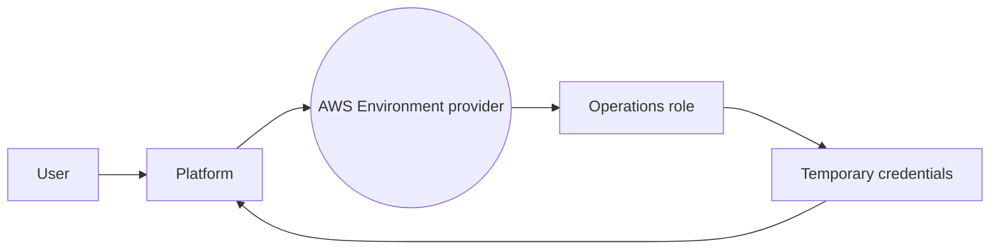
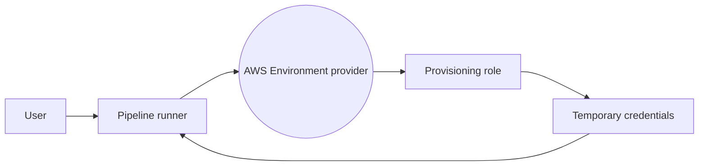
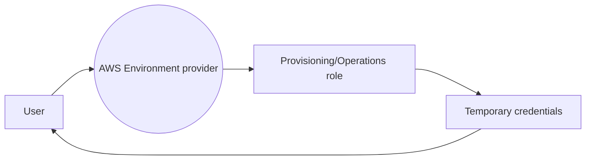
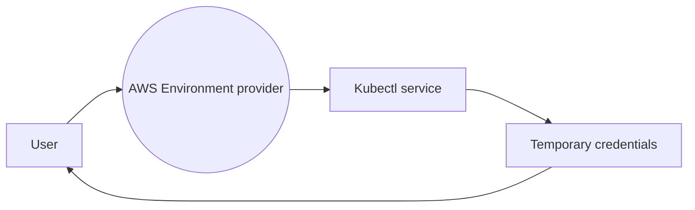

# Security

OPA on AWS is built on the Backstage open source project and, thus, inherits the security considerations applicable to the platform.  

The sections below capture details about the OPA on AWS reference implementation to help you understand the out-of-the-box implementations related to security.  Many of the configurations can easily be changed to meet your specific access control needs.

:::warning
It is **strongly** recommended that you read the [Backstage Threat Model](https://backstage.io/docs/overview/threat-model) documentation to familiarize yourself with the trust model and integrator responsibilities to secure access.
:::

## Authentication
The [Backstage Authentication system](https://backstage.io/docs/auth/) provides for sign-in and identification of users.  The OPA on AWS reference implementation is pre-configured to use Okta as an authentication provider. This demonstrates one type of authentication provider; however, it can easily be changed to other common identity providers such as Active Directory and other OAuth 2 supported providers.

:::info
Multiple providers are supported by Backstage. For the complete list, consult the [Backstage "Included providers" documentation](https://backstage.io/docs/auth/)
:::

## Organizational data
Backstage provides support to map organizational data such as users and groups into entities in the Backstage catalog.  The OPA on AWS reference implementation is pre-configured to use the `OktaOrgEntityProvider` from the [catalog-backend-module-okta plugin](https://www.npmjs.com/package/@roadiehq/catalog-backend-module-okta) from [Roadie](https://roadie.io).  This plugin will read Okta Users and Groups from a configured Okta instance and create entities in the catalog.  Once they are populated in the catalog, user and group entities can be used for creating relationships (e.g. "ownedBy") with other entities.  User and Group entities can also be used in the Backstage permission framework to enforce allow/deny policy decisions.

Alternatives for organizational data ingestion can be configured for [OpenLDAP](https://backstage.io/docs/integrations/ldap/org), [GitHub](https://backstage.io/docs/integrations/github/org), [GitLab](https://backstage.io/docs/integrations/gitlab/org), and more.  Consult the [Backstage Integrations documentation](https://backstage.io/docs/integrations/) and [Backstage plugin directory](https://backstage.io/plugins/) for additional options and details.


## AWS Security

### Introduction
While there are different methodologies when it comes to security in the cloud, we adopted some of the approaches we have seen at our financial customers. These include:

1. Segregation of access controls
2. Use of temporary credentials
3. Separation of duties and the least privileges principle
4. Use of different AWS accounts to ensure default restrictions
5. Separation of production/staging environments from development/sandbox environments

:::note
The above principles are not a replacement for organization-level preventive and detective controls. It is recommended to use services like [AWS Control Tower](https://aws.amazon.com/controltower/) and [Service Control Policies (SCPs)](https://docs.aws.amazon.com/organizations/latest/userguide/orgs_manage_policies_scps.html) to have multiple layers of security from the developer platform throughout the organization governance and controls.
:::


### Environments and access to AWS services
We define an environment as a "place" in AWS. Granting access to an environment will allow a user or process to gain access only to the resources of that environment, but not to other environments.

Definition of AWS Environment Provider:
* Include all of the supporting software artifacts to run a particular type of workload (Container-based, Serverless, AI/ML etc..).
* Must reside within an AWS Account and a region.
* Must provide at least two roles to gain access to the environment resources: a Provisioning role and an Operations role.
* Mutually exclusive by design - One provider cannot access resources from another provider, even if they are configured to use the same AWS account and region.

There are several methods for a user to gain access to an environment:
1. **Indirect access** - throughout the developer platform and pipeline, a developer can perform actions on an allowed target environment. The platform/pipeline will assume the target environment roles and get temporary credentials to perform the actions on behalf of the user.





2. **Direct access** - a user can assume credentials directly to the target environment access roles (Provisioning roles, operations role)



3. **Resource specific access** - a user can assume access to a particular shared resource by the environment, such as: kubectl


:::info
Environment provider authors can reason about the required set of permissions for provisioning and operating applications for this environment. OPA on AWS provides sample templates for Amazon ECS, Amazon EKS, and Serverless environment providers.
:::

### Diving deep to access roles trust policy

As described above, OPA on AWS provides a pattern of assuming access to particular AWS environments. Out of the box, when provisioning a new environment provider, the *provisioning role* and *operations role* are created and their trust policy is modified to enable the platform role and pipeline role respectively.

example of: commercial-us-commercial-dev-**provisioning-role** - Assumed by gitlab pipeline role
```json
{
    "Version": "2012-10-17",
    "Statement": [
        {
            "Effect": "Allow",
            "Principal": {
                "AWS": "arn:aws:iam::123456789012:role/opa-platform-GitlabRunnerConstructGitlabRunnerIamR"
            },
            "Action": "sts:AssumeRole"
        }
    ]
}
```

example of: commercial-us-commercial-dev-**operations-role** - Assumed by the platform role
```json
{
    "Version": "2012-10-17",
    "Statement": [
        {
            "Effect": "Allow",
            "Principal": {
                "AWS": "arn:aws:iam::123456789012:role/backstage-master-role"
            },
            "Action": "sts:AssumeRole"
        }
    ]
}
```

:::tip
You can also configure these roles with federation to grant access to your users based on their membership in certain group that is set up for your identity provider. This can be done with SAML or WebIdentity - for more information, [read here](https://aws.amazon.com/blogs/security/how-to-use-trust-policies-with-iam-roles/).
:::


